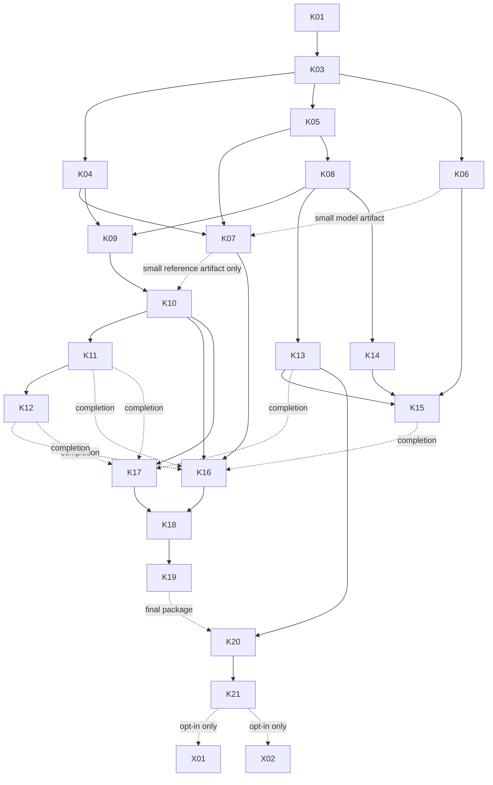

# k80nsai — master implementation atlas

Version 1.1, 2026-09-12. Master tracker: [#1](https://github.com/techrote/k80nsai/issues/1). Shared context: [RAG index](docs/rag/INDEX.md). Dependencies: [workflow.json](docs/workflow.json). Publication checks: [deployment audit](docs/DEPLOYMENT_AUDIT.md).

## Outcome and boundary

Build a simple terminal chat running real binary Bonsai GGUFs on a Tesla K80, with reference/B1/B2/B3/adaptive modes. Determine whether approximate activation bases improve actual decode throughput and where useful language fails. This is **one implementation phase** with incremental real-model checkpoints, not a formal synthetic benchmark prerequisite.

There are 20 required implementation tasks, one master tracker and two opt-in extensions. K02 was an ancillary automatic environment-doctor proposal that was not published; its ID is retired. K04 still records ordinary build-tool prerequisites. No core inference feature was removed.

Do not promise that Kepler compatibility needs only two patches, that a small model validates 27B's graph, or that fewer POPCs imply a token-rate speedup. Source observations and technical corrections are in [SOURCES_AND_DECISIONS.md](docs/rag/SOURCES_AND_DECISIONS.md).

## K01 source research and execution handoff

The [source map](docs/tasks/K01/SOURCE_MAP.md) selects an exact runtime and links five focused investigations. The [implementation handoff](docs/tasks/K01/IMPLEMENTATION_HANDOFF.md) preserves all existing task/issue mappings and distinguishes acceptance from readiness; [work-order refinements](docs/tasks/K01/WORK_ORDERS.md) supply evidence-backed instructions and outputs. [K01 status](docs/tasks/K01/STATUS.md) records actual review/publication checks. These refinements activate after maintainer acceptance of the K01 documentation PR and K01 signoff, not merely when issue bodies appear. Dependency edges below are unchanged. K03 is then the next import task; no downstream implementation was performed during research.

## First actions and early feedback

Start K01/#2 to pin and map the source. K03/#3 imports that exact revision without overwriting this workflow. Then K04 build compatibility, K05 host reference tests and K06 model acquisition can run in parallel. After K08 publishes the shared interface, CLI, telemetry and encoder work can proceed in separate files.

K07 begins small-model reference execution as soon as that model's identity/template artifact exists; it need not wait for the larger download. Attempt 27B reference as soon as its own inputs are ready. K10 needs **the small-model reference evidence**, not closure of all of K07. Thus a 27B-specific operator failure does not unnecessarily halt small-model B1/B2/B3 experiments. Conversely, do not postpone 27B testing until an approximate small model sounds good.

## Evidence checkpoints

| Checkpoint | Observable result | Tasks |
|---|---|---|
| M0 — known inputs | Pinned source, reproducible workspace, native ABI tests and model identity | K01, K03–K06 |
| M1 — first real experiment | Reference text, safe integration, B1 real-model execution, terminal chat and visible coverage | K07–K10, K13–K14 |
| M2 — real-model frontier | B2/B3/adaptive, 27B comparisons, saved prompt outputs and integration regressions | K11–K12, K15–K17 |
| M3 — usable handoff | Limited measured tuning, clean rerun, tested launch instructions and conclusion | K18–K21 |

These are documented checkpoints, not native GitHub Milestone objects or separate approval rounds. Individual dependencies govern work; do not wait for every M0 task to close before starting an already-unblocked M1 task.

## Reading the dependencies

`Start` means completed prerequisite tasks for integrated work. `Close also` adds evidence needed before closing the task. A named artifact gate requires that specific verified output, **not completion of every acceptance item in its producing issue**. Read-only exploration, corpus authoring and clearly marked drafts may happen earlier, but must not invent interfaces.

The JSON distinguishes `start_after`, `close_after`, `evidence_before_start` and `evidence_before_close`. Live issue status/comments are authoritative for completion; the manifest defines the dependency contract. These are linked/documented dependencies, not server-enforced GitHub blocking relations.

## Complete task atlas

| Task / issue | Deliverable | Start | Close also / evidence | Ownership and concurrency |
|---|---|---|---|---|
| K01 [#2](https://github.com/techrote/k80nsai/issues/2) | Pinned runtime, model architecture and dispatch map | none | source-inspection acceptance | Sole source-selection owner |
| K03 [#3](https://github.com/techrote/k80nsai/issues/3) | Reproducible runtime import and workspace | K01 | clean-checkout verification | Sole importer; preserve docs/history |
| K04 [#4](https://github.com/techrote/k80nsai/issues/4) | CUDA 11 native sm_37 compatibility build | K03 | actual target compilation | Build/architecture owner; parallel K05/K06 |
| K05 [#5](https://github.com/techrote/k80nsai/issues/5) | Native Q1 decoder and small independent basis oracle | K03 | host tests | Reference tests only; parallel K04/K06 |
| K06 [#6](https://github.com/techrote/k80nsai/issues/6) | Model manifests, acquisition and template inspection | K03 | actual small and 27B identities | Publish small artifact early; no weights in Git |
| K07 [#7](https://github.com/techrote/k80nsai/issues/7) | Small and 27B reference K80 execution | K04,K05 + K06 small-model artifact | K06 complete; both target runs | Publish small reference artifact early; GPU reservation |
| K08 [#8](https://github.com/techrote/k80nsai/issues/8) | Shared mode/dispatch/scratch/state API | K03,K05 | API/configuration tests | Sole shared-interface owner |
| K09 [#9](https://github.com/techrote/k80nsai/issues/9) | Fixed B1/B2/B3 GPU encoder | K04,K05,K08 | K80 encoder tests | Encoder owner; parallel CLI/telemetry |
| K10 [#10](https://github.com/techrote/k80nsai/issues/10) | B1 POPC GEMV on real model tensors | K08,K09 | K07 small-model reference artifact; B1 model test | Shared consumer owner; no full-K07 gate |
| K11 [#11](https://github.com/techrote/k80nsai/issues/11) | B2/B3 extension of shared consumer | K10 | real-model B2/B3 tests | Sequential consumer integration |
| K12 [#12](https://github.com/techrote/k80nsai/issues/12) | Adaptive depth with real early-stop accounting | K11 | real-model adaptive test | Coordinate encoder/consumer owner |
| K13 [#13](https://github.com/techrote/k80nsai/issues/13) | Persistent terminal chat and safe reset/mode commands | K03,K08 | K06 small-model artifact; reference chat test | CLI owner; parallel encoder |
| K14 [#14](https://github.com/techrote/k80nsai/issues/14) | Mode-aware coverage and lean timing runner | K08 | runner/counter tests | Instrumentation owner; shared hooks via K08 |
| K15 [#15](https://github.com/techrote/k80nsai/issues/15) | Fixed prompts and quality screening tools | K06,K13,K14 | runner tests | Corpus authoring can start earlier |
| K16 [#16](https://github.com/techrote/k80nsai/issues/16) | Untuned real 27B mode frontier | K07,K10,K13,K14 | K11,K12,K15; full mode matrix | Incremental runs; reserve board |
| K17 [#17](https://github.com/techrote/k80nsai/issues/17) | Layout/state/fallback regressions | K08,K09,K10 | K11,K12,K13; K80 tests | Test owner; fixes coordinated with code owners |
| K18 [#18](https://github.com/techrote/k80nsai/issues/18) | Bounded measured tuning | K16,K17 | regression and end-to-end evidence | Exclusive hot-kernel edits/timing slot |
| K19 [#19](https://github.com/techrote/k80nsai/issues/19) | Clean integrated rerun and baseline parity | K16,K17,K18 | K80 acceptance evidence | Freeze tuning during measurements |
| K20 [#20](https://github.com/techrote/k80nsai/issues/20) | Clean-checkout package and usable instructions | K13 | K19 | Docs can proceed early; final package after acceptance |
| K21 [#21](https://github.com/techrote/k80nsai/issues/21) | Final evidence report and decision | K20 | K19 | No new kernel scope |
| X01 [#22](https://github.com/techrote/k80nsai/issues/22) | Optional Q2 sign/magnitude-plane experiment | K21 + owner approval | separately scoped execution | Not a core blocker |
| X02 [#23](https://github.com/techrote/k80nsai/issues/23) | Deferred radical kernels/dual-GPU decision record | K21 + owner approval | one bounded follow-up decision | Not permission to implement every idea |

## Dependency picture

The table and JSON contain the complete edges; the diagram omits some transitive edges for readability. Dashed artifact edges must not be converted mechanically into whole-issue completion gates.

## Concurrency and resource rules

### Useful parallel work

After import, compilation, CPU oracle tests and model acquisition are independent. After the API lands, chat, telemetry and encoder work can proceed concurrently. Public prompt authoring and packaging notes do not need GPU access. Draft interfaces must be reviewed/merged before dependent agents implement against them.

### Prohibited overlap

Do not let agents independently invent mode enums, tensor eligibility rules, scratch layouts or interception sites. K08 publishes those once. Do not simultaneously edit the same consumer file from independent B1/B2/B3/adaptive branches; use one shared implementation with sequential integration. Do not repin upstream while dependent work is in flight without a coordinated rebase record.

A K80 board is one timing reservation even when both CUDA devices are visible. Shared power/thermal and host/PCIe resources can contaminate results. Concurrent isolated-device functional tests may be explicitly labelled, but headline measurements require the other device and competing board work to be idle. No clocks/power changes or per-layer cross-device inference are authorized here.

### Missing hardware and partial evidence

Useful source changes can be committed before execution. Track `implemented`, `host-tested`, `sm37-compiled`, `k80-tested`, `model-tested`, or `blocked` distinctly. An execution-gated issue stays pending when its code merges without target tests. Continue independent work and leave exact next commands; never manufacture results.

Artifact gates let independently useful evidence unblock work. For example K07 can remain open on 27B while its verified small-model reference artifact unblocks K10. That does not satisfy the programme's final 27B requirement.

## Reuse and efficiencies

K05 provides one CPU oracle reused by encoder, consumer and regression tasks. K09 provides one parameterized encoder; K10/K11 share a consumer rather than five unrelated backends. K14 provides one run record used for screening, tuning and final acceptance. Prefer per-operation preparation first; cross-consumer caching is optional and needs a generation-safe identity, not a reused pointer.

Multi-row activation reuse is important, but mandatory shared-memory staging is not: cache may already supply reuse and barriers can lose. Test a few real-shape mappings rather than expanding a synthetic benchmark. Do not infer DRAM traffic directly from source-level load counts.

## Acceptance and stopping

Core completion requires a working reference, all required modes connected to real tensors, simple chat, actual K80/small/27B execution and saved outputs/timings. It does not require a speedup or coherent B1. Genuine negative outcomes are useful; missing modes, CPU-only substitution and unexecuted kernels are partial work, not success.

Keep tuning bounded. Report fastest executed separately from fastest useful. Preserve unsupported-operation and quality limitations. Close the master only when required evidence is present; deferred X tasks are not blockers.
