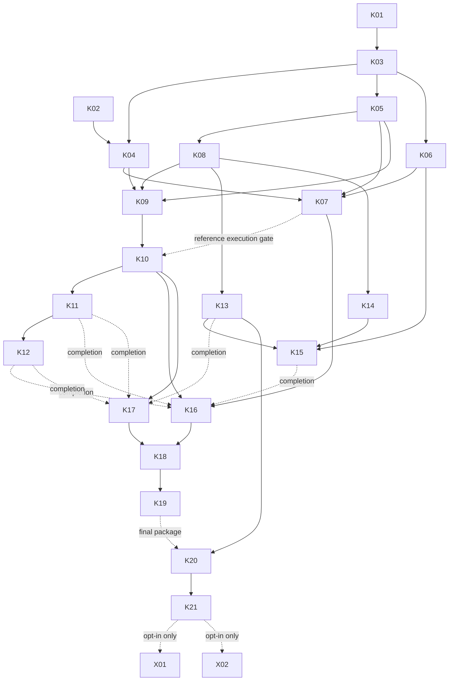

# k80nsai — master implementation atlas

Version 1.0, 2026-09-12. Master tracker: [#1](https://github.com/techrote/k80nsai/issues/1). Shared context: [RAG index](docs/rag/INDEX.md). Machine-readable dependencies: [workflow.json](docs/workflow.json).

## Outcome and scope

Deliver a simple terminal chat running actual binary Bonsai GGUFs on a Tesla K80, with reference/B1/B2/B3/adaptive decode. Measure whether binary-basis approximation buys end-to-end token throughput and where quality collapses. This is **one implementation phase**. Checkpoints below recognize evidence; they do not require stopping for a new planning phase.

Do not promise that K80 compatibility is two patches, that a smaller model validates 27B architecture, or that fewer POPCs imply a token-rate speedup. Current source observations and corrections are in [SOURCES_AND_DECISIONS.md](docs/rag/SOURCES_AND_DECISIONS.md).

## First actions

Start K01/#2 and K02/#3 concurrently. K01 establishes the exact source/model/graph map; K02 supplies a non-destructive environment report and preflight tooling. Then K03/#4 imports a reproducible runtime snapshot without overwriting this workflow. As soon as the reference path runs, attempt **both small-model and 27B reference bring-up**. Do not wait for an approximate mode to produce good language before testing 27B.

## Evidence milestones

| Checkpoint | Observable result | Primary tasks |
|---|---|---|
| M0 — known inputs | Pinned source, reproducible workspace, model identity, native format tests, environment understood | K01–K06 |
| M1 — first real experiment | K80 reference text, safe dispatch, B1 real-model execution, terminal chat and trustworthy timing | K07–K10, K13–K14 |
| M2 — real-model frontier | B2/B3/adaptive integrated, 27B mode matrix and prompt outputs, integration regressions | K11–K12, K15–K17 |
| M3 — usable handoff | Limited measured tuning, clean rerun, launch instructions and evidence-backed conclusion | K18–K21 |

M0 does not postpone reference coding until every document is polished. Individual task prerequisites govern execution. Work on an independent task continues when another is blocked.

## Task atlas

`Start` is the minimum completed prerequisite set for integration work. Read-only exploration or a clearly marked draft can happen earlier, but must not invent unpublished interfaces. `Close also` means evidence needed before calling that task complete, in addition to its own acceptance criteria.

| ID / issue | Deliverable | Start | Close also | Concurrency / owner boundary |
|---|---|---|---|---|
| K01 [#2](https://github.com/techrote/k80nsai/issues/2) | Pin candidate runtime/model architecture and dispatch map | none | none | source authority; parallel K02 |
| K02 [#3](https://github.com/techrote/k80nsai/issues/3) | Doctor/preflight; actual host capability or explicit absence | none | none | scripts/preflight; no privileged mutations |
| K03 [#4](https://github.com/techrote/k80nsai/issues/4) | Runtime snapshot, source lock, workspace and host CI | K01 | none | only runtime importer |
| K04 [#5](https://github.com/techrote/k80nsai/issues/5) | CUDA 11 native sm_37 compile and compatibility | K02,K03 | none | owns build/architecture compatibility |
| K05 [#6](https://github.com/techrote/k80nsai/issues/6) | Actual Q1 decoder and tiny independent basis oracle | K03 | none | tests/reference only; parallel K04/K06 |
| K06 [#7](https://github.com/techrote/k80nsai/issues/7) | Model manifests, acquisition, metadata/template inspection | K03 | none | no weights committed; parallel K04/K05 |
| K07 [#8](https://github.com/techrote/k80nsai/issues/8) | Real reference small + 27B bring-up and baseline | K04,K05,K06 | K80 access | exclusive runtime-validation slot |
| K08 [#9](https://github.com/techrote/k80nsai/issues/9) | Mode/config/dispatch API, scopes, scratch/cache lifetimes | K03,K05 | none | sole owner of shared dispatch/API |
| K09 [#10](https://github.com/techrote/k80nsai/issues/10) | GPU encoder, fixed B1/B2/B3 planes | K04,K05,K08 | K80 encoder tests | owns encoder implementation |
| K10 [#11](https://github.com/techrote/k80nsai/issues/11) | B1 POPC GEMV + actual model routing | K08,K09 | K07, K80 model test | owns binary GEMV; can draft before reference gate |
| K11 [#12](https://github.com/techrote/k80nsai/issues/12) | Extend shared dot path to B2/B3 | K10 | real-model B2/B3 tests | same kernel owner; do not fork duplicate implementations |
| K12 [#13](https://github.com/techrote/k80nsai/issues/13) | Adaptive early-stop encoding and consumption | K11 | real-model adaptive test | encoder/kernel owner coordination |
| K13 [#14](https://github.com/techrote/k80nsai/issues/14) | Plain terminal chat, reset/mode safety, launchers | K03,K08 | reference chat test | owns CLI/wrapper; parallel encoder |
| K14 [#15](https://github.com/techrote/k80nsai/issues/15) | Coverage counters and lean perf runner | K08 | none | owns instrumentation; shared hooks through K08 |
| K15 [#16](https://github.com/techrote/k80nsai/issues/16) | Public prompt corpus and quality screening runner | K06,K13,K14 | none | owns evaluation; CPU/mocks permissible for runner tests |
| K16 [#17](https://github.com/techrote/k80nsai/issues/17) | Untuned 27B mode frontier and outputs | K07,K10,K13,K14 | K11,K12,K15 | incremental runs permitted; hardware reservation |
| K17 [#18](https://github.com/techrote/k80nsai/issues/18) | State/stride/fallback/memory regression coverage | K08,K09,K10 | K11,K12,K13 | regression owner; fixes coordinated, not duplicated |
| K18 [#19](https://github.com/techrote/k80nsai/issues/19) | Bounded real-shape tuning | K16,K17 | none | exclusive hot-kernel edits and timing slot |
| K19 [#20](https://github.com/techrote/k80nsai/issues/20) | Clean integrated rerun, coverage and baseline parity | K16,K17,K18 | K80 execution | freeze tuning during measurements |
| K20 [#21](https://github.com/techrote/k80nsai/issues/21) | Clean-checkout package and usable instructions | K13 | K19 | docs/scripts in parallel; final package after freeze |
| K21 [#22](https://github.com/techrote/k80nsai/issues/22) | Final evidence synthesis and decision | K20 | K19 | no new kernel scope |
| X01 [#23](https://github.com/techrote/k80nsai/issues/23) | Optional Q2 sign/magnitude plane experiment | K21 + owner approval | separate results | NOT a core blocker |
| X02 [#24](https://github.com/techrote/k80nsai/issues/24) | Deferred FP64/sketch/braided/dual-GPU opportunity record | K21 + owner approval | scoped follow-up decision | NOT authorization to implement all ideas |

## Dependency picture

The table/JSON contain the complete edges; the diagram omits some transitive edges for readability.

## Concurrency rules

### Useful parallelism

After runtime import, build compatibility, host reference tests, and model acquisition can run independently. After K08's interface is merged, CLI, telemetry, and encoder development can proceed in different files. Evaluation corpus authoring does not require GPU access. Packaging documentation can start before the final performance run.

### Prohibited overlap

Do not have independent agents invent different mode enums, scratch layouts, or interception sites. K08 publishes those once. Do not edit the same CUDA file from B1/B2/B3/adaptive branches simultaneously. Use a shared template and sequential integration. Do not repin the upstream tree while dependent work is in flight without recording a coordinated rebase.

A K80 board is **one timing reservation**, even if both CUDA devices are visible: they can share power/thermal limits and host/PCIe resources. Concurrent isolated-device functional tests are allowed only if explicitly labelled; headline timing must run without competing work on the board. No changes to clocks or power limits are authorized here.

### Hardware pending

Tasks can have useful code committed before K80 execution. Keep status precise: `designed`, `implemented`, `host-tested`, `sm37-compiled`, `k80-tested`, `model-tested`, or `blocked`. Do not close an execution-gated issue merely because its code merged. If the agent has no K80, continue independent host/code tasks and leave exact commands plus the missing evidence. No made-up timings.

## Efficiencies and overlap

K05 supplies a single independent CPU basis oracle reused by K09–K12 and K17. K09 uses one parameterized encoder for B1/B2/B3, not three copies. K10 establishes a shared dot kernel extended in K11. K14 supplies one mode-aware timing/coverage record used by K15/K16/K18/K19. Cache basis data across consumers only with a valid tensor-generation key and measured benefit; initial per-op preparation is safer than stale pointer-keyed caching.

Multi-row activation reuse is a candidate, not a mandatory shared-memory implementation. Cache hits and synchronization cost must be measured. Do not infer actual DRAM traffic from source-level load counts.

## Acceptance and stopping

Core success means real K80 execution, a working reference, all required modes connected to real tensors, simple chat, reproducible measurements and recorded outputs. It does **not** require a speedup or coherent B1. Genuine negative outcomes are acceptable. Missing modes, CPU-only substitution, and source-only untested kernels are partial delivery, not completed POC success.

Use a bounded tuning pass, not a publication-grade benchmark campaign. Keep clean reference parity, minimal repeatability, and visible dispatch coverage. Finish with a fastest-executed mode and a fastest-useful mode separately; if none is useful or faster, say so.
